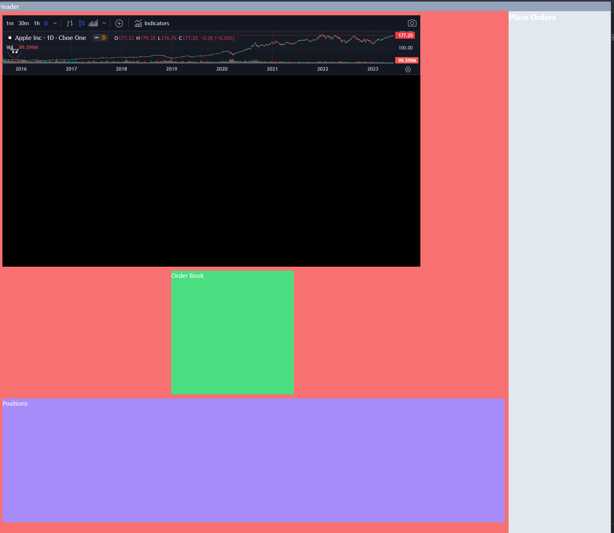

# DeLimit

A decentralized limit order Dex. The initial use cases will be:
1. Alternative UI for dydx v3 with a built-in USDC deposit-withdraw bridge from Solana
1. Using Orca Whirlpools as a limit order book. It makes sense to go with Orca as Orca has all the volume & liquidity.

# Development

Create a codespace for the project then run any of the following commands

Commands
- `x add [lib|app|svc|cli|sc] <name of package> <name of dep>`
- `x cln [lib|app|svc|cli|sc] <name of package>` (clean dependencies from all repos)
- `x del [lib|app|svc|cli|sc] <name of package> <name of dep>`
- `x dep [app|svc|sc] <name of package>` (deploy an application, service or smart contract)
- `x dev [app|svc|sc] <name of package>`
- `x new <package template> <name of package>`
- `x psh` (commits and pushes to git)
- `x pub <name of library>` (publish a library to npm or cargo)
- `x tkn [sol|sui|xrd] <name of token>`
- `x tst [lib|app|svc|cli|sc] <name of package>` (run tests for a package)

# Current Progress

- [x] Integrated trading view widget
- [ ] Added order book
- [x] Plug widgets into grid view
- [ ] Data source for DyDx
- [ ] Data source for Orca
- [ ] Bridge from Solana to StarkNet for DyDx v2
- [ ] Smart contract for limit orders above Orca Whirlpools

Latest screenshot

